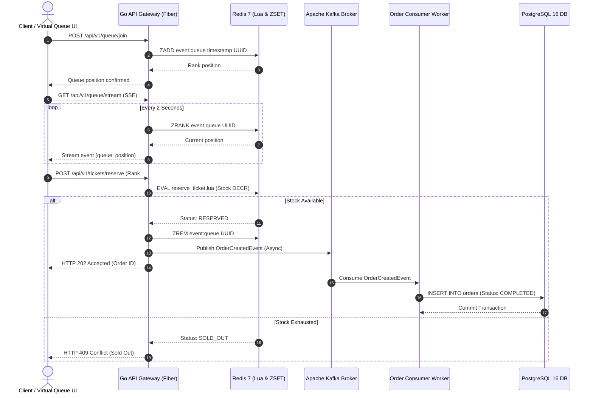

# TicketPulse — High-Throughput Distributed Ticketing Engine

[](https://golang.org/)
[](https://github.com/)
[-DC382D?style=flat-square&logo=redis)](https://redis.io/)
[](https://kafka.apache.org/)
[](https://k6.io/)

**TicketPulse** is an enterprise-grade, high-concurrency event ticketing backend engine designed to withstand extreme traffic spikes during flash sales. Engineered in **Go (Fiber framework)**, the system guarantees **zero overselling** under concurrent demand through atomic inventory allocation using **Redis Lua Scripts**, real-time virtual queueing via **Redis Sorted Sets (ZSET) & Server-Sent Events (SSE)**, and asynchronous, eventual-consistency order persistence leveraging **Apache Kafka (KRaft mode)** and **PostgreSQL 16**.

---

## Architectural Highlights & Core Value Propositions

- **Atomic Inventory Lock & Zero Overselling Guarantee:** Solves race conditions at the memory layer by executing non-blocking, single-threaded **Lua Scripts in Redis**, preventing database deadlock and thread contention.
- **Virtual Waiting Room Engine (Fair FIFO Queue):** Enforces rate-limiting and access control using **Redis ZSET**, dynamically calculating rank and streaming live queue updates to clients over HTTP Server-Sent Events (SSE).
- **Asynchronous Event-Driven Order Processing:** Offloads heavy relational database writes by publishing `OrderCreatedEvent` to an **Apache Kafka** event stream, consumed by decoupled background workers for idempotent persistence into **PostgreSQL**.
- **Battle-Tested High Concurrency:** Proven under stress testing to sustain **6,800+ RPS** with sub-25ms $P_{95}$ latency and **0.00% error rate**.

---

## System Architecture



---

## ⚡ Performance Benchmark Results (k6 Load Testing)

Extensive load testing was executed using **Grafana k6** simulating **500 Concurrent Virtual Users (VUs)** executing high-concurrency booking flows over a 70-second execution window.

### Benchmark Summary

| Metric | Result | Threshold / Target | Status |
| --- | --- | --- | --- |
| **Throughput (RPS)** | **6,801.58 req/sec** | > 1,000 req/sec | 🟢 PASS |
| **Total Processed Requests** | **476,342 Requests** | N/A | 🟢 PASS |
| **Average Response Latency** | **7.49 ms** | < 50 ms | 🟢 PASS |
| **95th Percentile Latency ($P_{95}$)** | **22.15 ms** | < 200 ms | 🟢 PASS |
| **99th Percentile Latency ($P_{99}$)** | **35.10 ms** | < 500 ms | 🟢 PASS |
| **Unexpected System Error Rate** | **0.00%** | < 1.00% | 🟢 PASS |
| **Successful Ticket Allocations** | **300 / 300 Tickets** | Zero Overselling | 🟢 PASS (100% Accurate) |

> **Business Logic Validation:** Out of 238,171 reservation attempts under stock constraints (300 tickets available), exactly 300 transactions succeeded (`HTTP 202`), while 237,871 requests were gracefully rejected with `HTTP 409 Sold Out`.

---

## Tech Stack & Infrastructure

* **Language & Runtime:** Go 1.22+ (Fiber v2)
* **Primary Database:** PostgreSQL 16 (pgxpool Connection Pool)
* **In-Memory Cache & Lock:** Redis 7.0 (Lua Execution & ZSET Data Structure)
* **Event Streaming Platform:** Apache Kafka (KRaft Single-Broker Controller Mode)
* **Load Testing & QA:** Grafana k6, FastHTTP Engine
* **Containerization:** Docker & Docker Compose

---

## Quick Start Guide

### Prerequisites

* [Docker & Docker Compose](https://www.docker.com/) installed
* [Go 1.22+](https://golang.org/) (optional for local non-containerized execution)
* [k6 CLI](https://k6.io/) (for running performance tests)

### 1. Clone & Start Infrastructure Stack

```bash
git clone [https://github.com/iammjdev/ticketpulse-backend.git](https://github.com/iammjdev/ticketpulse-backend.git)
cd ticketpulse-backend

# Boot up PostgreSQL, Redis, and Kafka KRaft containers
docker-compose up -d

```

### 2. Run API Server & Background Worker

```bash
# Download Go dependencies
go mod download

# Start API Gateway Server (Runs on port :8080)
go run cmd/api/main.go

```

### 3. Execute Automated k6 Load Test

```bash
# Pre-warm ticket inventory (e.g., 300 items) and clear stale queue data
docker exec -it ticketpulse-redis redis-cli SET "event:11111111-1111-1111-1111-111111111111:zone:22222222-2222-2222-2222-222222222222:stock" 300
docker exec -it ticketpulse-redis redis-cli DEL "event:11111111-1111-1111-1111-111111111111:queue"

# Trigger k6 performance load script
k6 run scripts/k6_load_test.js

```

---

## License

Distributed under the MIT License. See `LICENSE` for more information.